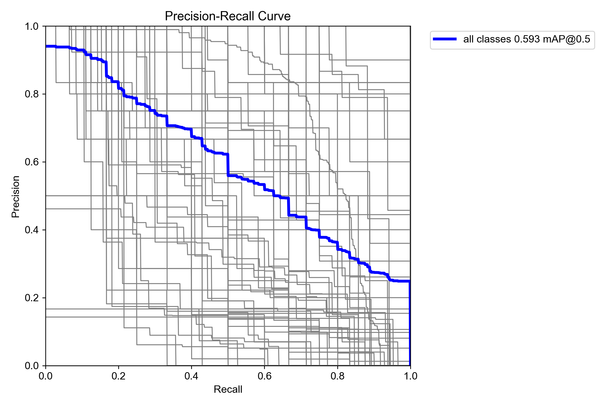
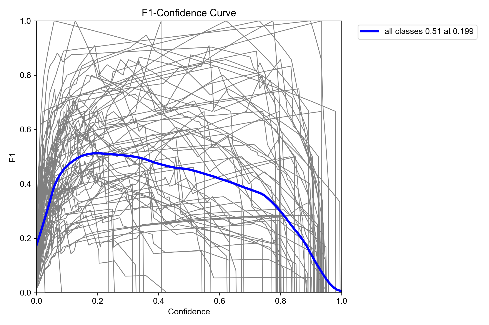
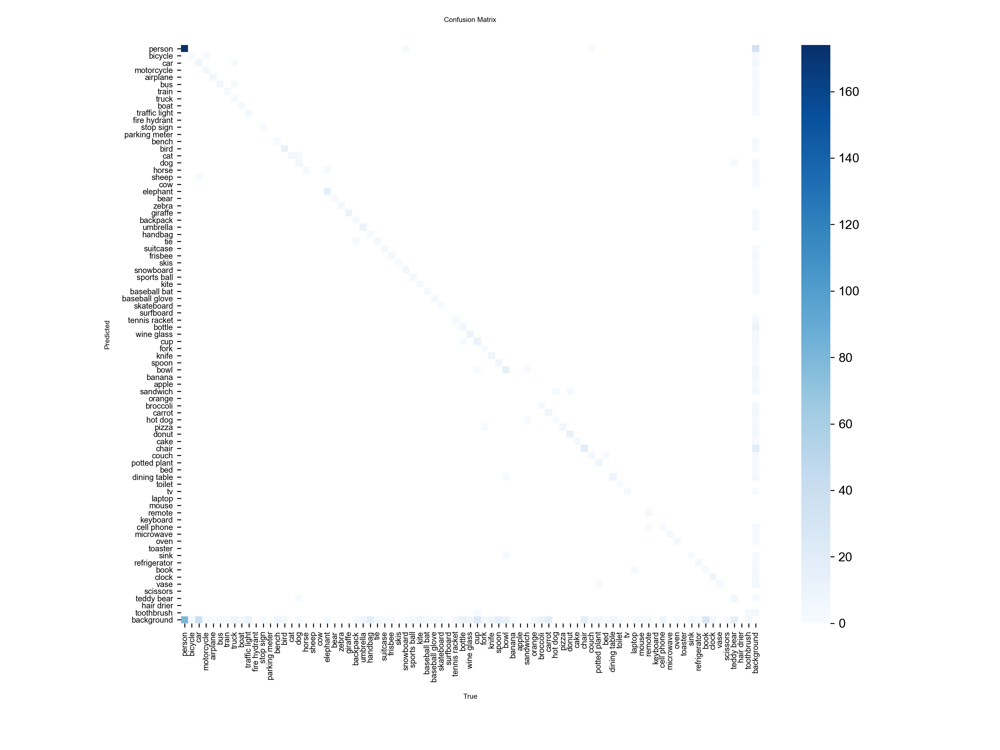

# Week 3 - Task 1 (Semantic Segmentation)

## Description
Performed semantic segmentation using YOLOv8 model on multiple images.

## Video Output
https://drive.google.com/file/d/1Qc0aTe_R_bgM9kvtcbyC50TuJtnccN6F/view?usp=drive_link

## Performance Metrics

- Precision: 0.571  
- Recall: 0.566  
- mAP50: 0.593  
- mAP50-95: 0.439  

## Output Graphs

